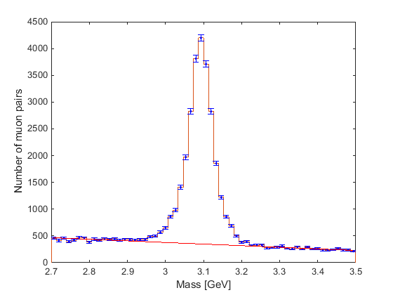

# **Particles Discovery Lab**

The goal of this exercise is to reconstruct decays of an unknown particle X (initial state) to 2 muons (final state). To achieve this goal, participants need to display histograms for the calculated mass of particle X and learn about fitting and subtracting background distributions from data.

Uncertainty propagation concepts are included at each step of the analysis. After isolating the signal distribution, participants will determine which particle they have discovered and compare its properties (mass and width) to known properties.

## **Get Ready**

* Have the **my_python** container ready. The steps to install Docker and create this container are mentioned in the pre-exercises.
* Git clone this repository inside the **my_python** container and ensure the following files have been created: **pollsf.py**, **MuonAnalysis.ipynb**, and **DoubleMuParked_100K.pkl**.
* **Optional (strongly recommended)**: Download the files **pollsf.py**, **MuonAnalysis.ipynb**, and **DoubleMuParked_100K.pkl**. Then upload these files to your Google Drive and open them with Google Colab.

## **Steps**

1. Run the command `docker start -i my_python`. If the repository was correctly cloned, you should have a file called `MuonAnalysis.ipynb`. Open this file with a text editor. One way to do this is to run `nano MuonAnalysis.ipynb`.
2. Read the text and uncomment the code lines. Then save the changes and close the text editor. Test the changes by running the command `python MuonAnalysis.ipynb`.
3. Continue opening this file, completing the code tasks, and testing the results by running the command `python MuonAnalysis.ipynb`.

## **Note**

Notice that the graphs generated by the matplotlib library will not be displayed due to the lack of an interface inside the container. Therefore, instead of using the command `plt.show()`, change that command to `plt.savefig('name_of_graph.png')`. Then, a file called 'name_of_graph.png' will appear in your container. Copy that image to your local machine and then open it. Recall from the pre-exercises that to copy a file from your container, you must exit the container and run the following command: `docker cp name_of_the_container:path_of_the_file_inside_the_container local_path_outside_the_container`. If you don't know the path of the file inside the container, start the container and navigate to the file location. Then run `pwd` to get your path inside the container.

## **Recommendation**

From the previous description, it is noticeable that copying the image file to your local machine every time it is generated could be a tedious task. Therefore, to save time, it is better to complete all the **MuonAnalysis.ipynb** code on Google Colab. Notice that **MuonAnalysis.ipynb** will work only if the files **pollsf.py**, **MuonAnalysis.py**, and **DoubleMuParked_100K.pkl** are in the same drive file. An adapted version for running the script on Google Colab can be found in this repository. Then, download **pollsf.py**, **MuonAnalysis.py**, and **DoubleMuParked_100K.pkl** to your local machine. Finally, copy those files into the **my_python** container, then generate all the images inside your script and copy the images to your local machine to view them.
